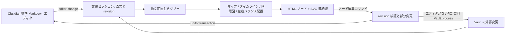

# Mappy の設計と試作実装

更新: 2026-09-19。現在の実装と、引き続き検証する条件を記す。実装済みという記述は、対応環境全体での動作保証を意味しない。

## 1. 中心となる判断

**文書の正本は Markdown 一つにする。マップはその投影と編集 UI にする。** マップ専用 JSON と Markdown を相互変換して保存する構成は採用しない。変更していない本文をそのまま残すことを、描画より先に設計する。



TypeScript＋esbuild と標準 DOM を使う。ノードの表示には Obsidian の MarkdownRenderer、ノードのインライン入力には専用 textarea を使い、分割先は標準 Markdown エディタを使う。React や汎用グラフエディタは導入していない。

## 2. モジュール境界

| 層 | 責務 | 外部依存 |
| --- | --- | --- |
| `src/main.ts` | view・command・ribbon・ファイルメニューの登録 | Obsidian |
| `src/core/markdown.ts` | 構文解析、原文範囲、ノードの対応付け | `@lezer/markdown` |
| `src/core/commands.ts` / `list-commands.ts` / `body.ts` | rename / add / move / delete / 本文変更 → 原文差分 | 純粋 TypeScript |
| `src/core/list-conversion.ts` | 旧見出し形式から H2＋箇条書きへの明示変換 | 純粋 TypeScript |
| `src/core/topics.ts` / `yaml-lite.ts` | frontmatter `mappy-topics` の読み取り（YAML サブセット）と、そのキーだけを差し替える書き込み（移動・改名時の持ち越し・削除時の除去） | 純粋 TypeScript |
| `src/layout/layout.ts` | tree＋実測サイズ → マップ／タイムライン／階層図／左右バランスの座標と線。モードの振り分け、右向き・左向き（鏡像）の枝の配置、フリートピックの配置 | 純粋 TypeScript |
| `src/layout/hierarchy.ts` / `primitives.ts` | 階層図（ルートを上、親ごとに段揃え）の配置本体と、全モード・renderer が共有する矩形・線・開閉ボタンの型と寸法 | 純粋 TypeScript |
| `src/interaction/viewport.ts` | パン・ズーム・Fit の座標計算 | 純粋 TypeScript |
| `src/core/attachments.ts` / `plain-text.ts` | 本文からのリンク・画像抽出、タイトルの平文化 | `@lezer/markdown` |
| `src/export/excalidraw-scene.ts` / `src/layout/path-points.ts` | tree＋計測 → 描画 API 非依存のシーン（ブロック・折れ線） | 純粋 TypeScript |
| `src/export/svg-document.ts` | SVG 書き出しのシーン（ノードの XHTML・線のパス・バッジ・色）→ SVG 文字列、viewBox と余白、PNG の縮尺、スタイルの重複除去 | 純粋 TypeScript |
| `src/export/svg-capture.ts` | 配置済みのノード要素と `LayoutResult` → シーン。算出スタイルの白名簿を直列化し、画像は差し込まれた resolver で data URL に。SVG → canvas → PNG | DOM（Obsidian の global `createEl` で作業用要素） |
| `src/obsidian/image-export.ts` | Vault の画像を data URL に読む resolver、添付設定の保存先への `create`／`createBinary`、モバイルのピクセル上限 | Vault、metadataCache、FileManager、`requestUrl`、`Platform` |
| `src/obsidian/document-store.ts` | Editor/Vault の一本化、原文照合、キュー、履歴 | Obsidian の公開 API |
| `src/obsidian/frontmatter.ts` / `map-files.ts` | `mappy: true` の識別、初期レイアウト、新規マップ作成 | metadataCache、FileManager、Vault |
| `src/obsidian/settings.ts` / `settings-tab.ts` | 設定の型・既定値・欠損／旧形式の正規化と、`PluginSettingTab`（`display()` と 1.13 以降の `getSettingDefinitions`）。保存は `main.ts` の `loadData`／`saveData` | Obsidian の Setting UI |
| `src/obsidian/view-routing.ts` / `patch.ts` | frontmatter を持つノートを map view へ導く `setViewState` の差し替え | WorkspaceLeaf.prototype |
| `src/obsidian/excalidraw-bridge.ts` / `src/types/excalidraw-automate.ts` | Excalidraw の `ExcalidrawAutomate` へのドロップフック連結と要素生成 | `window.ExcalidrawAutomate`（任意） |
| `src/ui/mindmap-view.ts` | ファイル・表示状態、描画更新、編集経路の接続 | Obsidian ItemView |
| `src/ui/node-renderer.ts` | ノードの差分描画、計測、MarkdownRenderer の寿命。`![[マップ]]` だけの題名は view から渡された resolver（`NodeEmbedResolver`）で枠にし、entry の Component に寿命を合わせる | Obsidian MarkdownRenderer |
| `src/ui/map-events.ts` / `node-drag.ts` / `map-viewport.ts` | キー・リンク・画像貼付（クリックの解釈 `mapClick` は埋め込みと共有。`nodeOf` はそのキャンバスのノードだけを答え、ノードの中に描いたマップのノードを取り違えない）、pointer イベントによるノードのドラッグとゴースト、DOM のパン／ズーム | Obsidian Component、DOM |
| `src/layout/drop-preview.ts` / `snap.ts` | ドラッグ中の移動先に仮ノードを差し込んだレイアウト用の木と、運んだトピックのルートの矩形からレイアウト別の幾何で合流先を決めるスロット判定 | 純粋 TypeScript |
| `src/ui/inline-editor.ts` / `link-suggest.ts` | インライン入力とノート候補 | DOM、候補取得時の Obsidian API |
| `src/core/embed.ts` / `map-keys.ts` | 埋め込み（M10）の純粋な部分: 原文からのマップ識別と `mappy-layout`（キーは `map-keys.ts` で cache 側と共有）、`#見出し` の区画解決（Obsidian の `stripHeading` に準じた正規化と最初の一致）、埋め込みが描く木、開いた時点の折りたたみ、可視ノード。項目が埋め込み 1 つだけかの判定（`embedOnlyTitle`、M12） | 純粋 TypeScript |
| `src/obsidian/embed-target.ts` | `.internal-embed` の `src` からマップノートと見出しパスを解決（`parseLinktext`、`getFirstLinkpathDest`、metadataCache の `mappy: true`） | Obsidian の公開 API |
| `src/ui/map-embed.ts` / `edge-layer.ts` | post-processor（`MapEmbeds`）と、区画の寿命に合わせた読み取り専用のマップ（`MapEmbed`: `MarkdownRenderChild`）。map view のノードの中に同じ枠を描く resolver（`nodeEmbeds`、M12）。線の差分描画 | Obsidian MarkdownRenderChild、MarkdownPostProcessor |

Markdown parser は原文の UTF-16 offset を得られる `@lezer/markdown` を採用した。通常の Markdown を構文解析し、frontmatter と Obsidian コメントを補助処理する。製品コードはブラウザ互換にし、Node/Electron や非公開の Obsidian parser を使わない。ランタイム依存は package.json で固定し、バンドルの実測値とハッシュは各ビルドの `dist/build-info.json` と証跡で追う。モバイル互換性は設計上の条件であり、実機では未確認。

## 3. Markdown とノードの対応

H2＋箇条書きの形式と、従来の見出し形式を実装している。文書直下に H2 以外の見出しがある場合は `format: 'headings'`、H2 だけ・見出しなしの場合は `format: 'list'` とする。コード・引用・コメント・frontmatter の偽見出しは判定に使わない。編集検証では必要に応じて既存の形式を指定して再解析できる。

解析上はファイル名の仮想ルートを持ち、その直下に最上位区画（見出し形式では最上位の見出し、リスト形式では H2 と、最初の H2 より前の文書直下のリスト項目）を並べる。表示は `projectMap` で本体とフリートピックに分ける（M7）。文書が見出し区画で始まればその区画が本体、後ろの最上位区画はフリートピック。見出しのない文書は仮想ルートのまま。最初の H2 より前に文書直下のリスト項目がある文書は、仮想ルートを本体（そのリスト項目だけを子として見せる）にし、すべての H2 区画をフリートピックにする。この分割は表示だけであり、ノードの範囲・親子・ID は変えず、コマンドは従来どおり `doc.root` の木に対して動く（H2 の兄弟追加は文書末尾寄りの新しい最上位区画になる）。表示のために原文を足し引きしない。リスト形式では、文書直下の BulletList を直前の H2 配下へ、H2 より前のリストを仮想ルート配下へ置く。

フリートピックの位置は frontmatter `mappy-topics` に、見出しの文をキー、レイアウト名をサブキーとして `[x, y]` で持つ（`src/core/topics.ts`）。座標は本体ルートのノード左上を原点とするレイアウト座標で、トピックのルートのノード左上を指す（`LayoutResult.origin`）。Mappy は flow 形式 `見出し: { mindmap: [x, y], timeline: [x, y] }` を 1 行ずつ整数で書き、YAML や自前の読み取りが誤読し得るキー（`:`・`#`・`[` を含む、数値や真偽値に見える、空、先頭が記号）は二重引用符で囲む。読み取りは `src/core/yaml-lite.ts` の YAML サブセットで、Obsidian の Properties が書き直す block 形式と引用符付きキーも受け付け、孤児キー・不正値は無視する。書き込みは `mappy-topics` の行だけを差し替え、他のキーはバイト保持、frontmatter がなければ作り、最後の項目を除いて他のキーが残らなければヘッダーごと取り除く。存在しない見出しのエントリは読めた限り残す（Markdown 側で改名を戻せば位置も戻る）。マップ側の改名（`rename`）は同じ編集セットでキーを差し替え、改名先の名を持つ別のトピックがあればその位置を奪わない。同名のフリートピックは最初の 1 つだけが保存位置を使い、残りは既定位置に置く（product-plan §7 の再検討条件）。metadataCache の値から読む場合は `topicPositionsFromValue` を使い、開いているエディタの原文を正とする経路は `readTopicPositions` を使う。入れ子は Lezer の ListItem 構造に従い、タブを含むインデントを独自の行正規表現だけで推測しない。OrderedList とタスク項目、およびその下位は原文を保持してノード化しない。

```markdown
---
mappy: true
---
## 講座

講座全体の説明。

- 回復する
  参考: [[睡眠ノート|睡眠]] と [資料](https://example.com)
  ![[図.png]]
  - 休息の取り方
    この本文もノードと一緒に保持する。
```

`mappy: true` はマップの必須識別子である。文字列 `"true"`、`false`、`mappy-layout` だけのノートは対象にしない。`mappy-layout` は任意の初期表示設定で、`timeline` ならタイムライン、`hierarchy` なら階層図、`balanced` なら左右バランス、それ以外と省略時は通常マップにする（値の一覧は `src/core/layout-mode.ts` の `LAYOUT_MODES` が唯一の定義で、frontmatter・view state・レイアウトボタン（`Record<LayoutMode, …>` で網羅を型検査）・Excalidraw 挿入はすべてそれを使う。`layout.ts` からも再 export する）。新規作成・マインドマップ化・解除と、レイアウトボタンによる明示選択だけが frontmatter を書く。タイムライン・階層図・左右バランスの選択は `mappy-layout` にその値を保存し、通常マップ選択はキーを削除する。閲覧・折りたたみ・ズーム・Excalidraw への挿入では書かない。旧 `mappy-layout` 単独ノートは自動で取得せず、明示的なマインドマップ化で旧レイアウトを引き継いで `mappy: true` を追加する。新規作成と、`mappy-layout` を持たないノートのマインドマップ化が書く値は設定「新規マップの既定レイアウト」（M14、既定は通常マップ＝キーなし）で、既存ノートの読み取り（`readMapLayout`）は設定を見ない。ファイル・レイアウト・viewport は各 leaf の view state で扱い、選択と折りたたみはビュー内の一時状態として保持する。

- ATX 見出し、Setext、frontmatter、フェンス、空行、CRLF、末尾改行、引用、コメントを fixture で扱う。初期に編集未対応の構文は表示または source 編集へ誘導し、推測で変更しない。
- 不明な記法は原文の範囲として保存する。本文を AST 全体から再生成しない。
- 従来の見出し形式で深さが飛ぶ場合は、直前の小さい深さの見出しへ接続する。原文は自動修正しない。
- 同名見出しがあるため、タイトルや配列の位置だけをノード ID にしない。セッション内 ID と原文範囲、編集差分を対応付け、外部全変更では一致する部分を再対応する。曖昧なら選択を解除し、古い ID で書き込まない。
- 従来の見出し形式だけは最大深さ6を、移動後の子孫も含め検証する。リスト形式にはこの上限を設けない。

リスト項目の `from` はインデントを含む行頭、`headingTo` は最初の行末、`titleFrom/titleTo` は最初の行のテキストを表す。`to` は ListItem の最終行の末尾で、直後の改行は含めない。子リストの後にある親の文章を、子の `to` に含めない。直接本文は初行改行後から最初の子の行頭までとし、子がなければ ListItem の末尾まで。本文がない葉では `bodyFrom/bodyTo` を `to` の空範囲にする。

`node.list` にマーカー前の生のインデント、`-` / `+` / `*` のマーカー、継続本文の必要列数に相当する空白列を保持する。本文画面へ渡す際にはコンテナのインデントだけを除き、保存時に戻す。本文編集・リンクや画像の追記はその原文範囲だけを変更し、周囲のノード構造を再解析して確認する。最初の子より後の親の文章は保持するが、直接本文の編集 UI には含めない。

旧見出し形式からの変換は `planListConversion` で見出しの範囲と本文各行へのインデント挿入だけを計画し、DocumentStore の通常経路から保存する。変換後のタイトル・件数・親子関係を照合する。本文内の箇条書きで余計なノードが増える場合や複数行 Setext など、安全な変換ができない場合は拒否する。閲覧時の変換は行わず、明示操作後は同じマップ履歴で Undo できる。

## 4. 同期・保存・Undo

**通常の MarkdownView＋マップ ItemView の分割**と同じ leaf での切り替えを実装している。分割先には標準 Undo と標準リンク補完のある公式 Editor を使う。マップ内の textarea と履歴は別に管理する。ノート種別 `.md` のグローバルな登録は置き換えない。

### Markdown → map

1. 対象ファイルの `editor-change` から保存前のテキストを取得する。metadata cache はリンク解決の補助であり、編集中原文の正本にしない。
2. `editor-change` と対象ファイルの変更通知を 45ms の debounce でまとめる。
3. ビューの更新世代を読込前後で確認し、ファイルや世代が変わった非同期結果を破棄する。
4. ノード ID で DOM を差分更新し、選択と viewport を保つ。毎回 Fit を実行しない。

### map → Markdown

1. コマンドは解析時の文書から UTF-16 の原文範囲と置換テキストを生成する。保存時には差分とともに期待する元文書を渡す。
2. キューをファイル単位に直列化し、最新バッファが期待原文と完全一致することと、差分範囲の妥当性を確認する。
3. 開いているエディタには一つの `Editor.transaction` で適用する。未保存バッファがある状態で Vault へ直接書かない。
4. エディタがない場合のみ、`Vault.process` のコールバック内で期待原文を検証して差分を適用する。読み取りと書き込みの間で更新されても古い内容を押し戻さない。
5. 自分の変更も最新の原文として観測する。外部変更を検出したら古いマップ履歴を捨て、通知を無条件に無視しない。
6. 競合したら古い原文で上書きせず、インライン入力のドラフトとエラーを残す。自動マージはせず、必要な入力を保持したうえで更新後のノードを編集し直す。

複数 MarkdownView が同じファイルを開いた場合は、バッファが一致することを確認する。一つに transaction を適用して共有バッファへ伝播済みなら次への適用を省き、独立バッファなら変更前原文が一致するエディタへ適用する。内容が不一致なら自動変更を止める。この分岐をモックで検証しているが、別ウィンドウを含む実機の組み合わせは引き続き確認する。

### 表裏切り替えの検証課題

`ItemView` はファイルの自動保存・Undo をそのまま引き継ぐわけではない。切り替え実装では対象ファイルと選択ノードの原文位置から Markdown を開く。切替時の未保存内容、選択位置、Ctrl/Cmd+Z の送り先、エディタが閉じた場合の履歴は M2 の実機受入条件として残す。

マップ操作はファイルごとに最大50件の前後原文・差分・逆差分をセッション履歴に保持し、Undo/Redo も現在原文を照合して適用する。Markdown 側の編集や外部変更を観測すると履歴を破棄する。標準エディタとマップの履歴を完全に統合したものではなく、プラグイン再読込後の履歴も永続化しない。

`TextFileView` も候補だが、`requestSave` の遅延保存と標準エディタの保存が競合し得るため初期の保存主体にしない。この点は「表裏切替が自動的に安全になる API がある」と仮定しない。[公式 API 型定義](https://github.com/obsidianmd/obsidian-api/blob/master/obsidian.d.ts)

## 5. 描画・リンク・画像

HTML ノード＋SVG 接続線を一つの変換レイヤーに配置する。ノード ID と描画内容のキーで DOM を再利用し、描画後にまとめてサイズを読み取って座標を書き込む。現在は可視ノードを計測して全体を配置するため、枝だけを再配置する最適化は未実装。

ノードの表示は `MarkdownRenderer.render(app, markdown, el, sourcePath, component)` を使う。`sourcePath` は元ファイルで、component はノードの描画寿命に合わせる。差し替え時は古い描画を破棄し、関連 component・イベントも解放する。[ライフサイクル管理](https://docs.obsidian.md/plugins/guides/lifecycle-management)

内部リンクは `openLinkText`、解決は `getFirstLinkpathDest`、作成は `generateMarkdownLink` を境界へまとめる。クリックではリンクを優先し、ノードドラッグへ伝播させない。見出し／ブロック参照、別名、空白、日本語を検証する。画像追加は添付先を Obsidian の設定から取得し、重複を避けて保存する。ローカル画像を初期の受入対象とし、外部画像の読込方針・エラー表示は M3 で明文化する。[公式 API 型定義](https://github.com/obsidianmd/obsidian-api/blob/master/obsidian.d.ts)

本文全部を常に全ノードへ描画せず、ノードのテキストと直接本文内のリンク・画像を表示する。通常の文章は右クリックの本文編集から扱う。画像読込とビューのサイズ変更で再配置する。描画の差し替え時には古い Component を解放する。

表示ルートの ID で濃い面のルートを判定し、その直接の子は枠付き、下位は平文にする。H2 がルートの場合も同じ基準を使う。フリートピックのルートも濃い面（`is-root` に `is-topic` を併記）で、その直接の子が枠付きになる。線はノード領域の左右中央へ接続し、文字の下へ伸ばさない。通常マップも直角線にし、親から共通の幹を伸ばして分岐点から子へ接続する。現在の通常マップの横間隔はルート80px・下位56px、兄弟の縦間隔は22pxとし、タイムラインとは別の寸法を使う。

`LayoutResult.folds` に開閉操作の中心座標を返し、renderer が分岐点にボタンを配置する。展開中はボタンの領域へカーソルを合わせたとき、またはキーボードフォーカス時に丸い − を表示する。折りたたみ件数には直接の子だけでなく隠れる子孫をすべて含める。数字の桁数で変わるバッジ幅とヒット領域の寸法を layout と renderer で共有し、枝間の余白と Fit の bounds に含める。閉じた枝にも開閉座標を残す。

`layoutTree` は本体を原点に配置したうえで、各フリートピックを同じモードの独立した木として配置する。位置があるトピックは `origin + 位置` に置く（他のノードと重なっても利用者の指定を優先する）。位置がないトピックは本体の bounds の下に原文順で積み、配置済みのどの矩形（開閉ボタンを含む）とも重ならない最初の空きに置く。列はマップとタイムラインでは本体の左端に揃え、階層図と左右バランスでは本体の左端が最も広い段や左側の枝の端になり得るためルートの中央に揃える。Fit の bounds は本体・トピック・開閉ボタンすべてを含む。ドラッグ中の仮ノードは移動先を含む木（本体または一つのトピック）だけを組み替える。Excalidraw への挿入（`sceneContents`）は本体のみで、フリートピックを含めるかは M7 の残項目。

大規模化は、差分更新 → 折りたたみ → 可視領域外 DOM の省略の順に検討する。Worker や WebGL は、計測で必要性が出た段階で判断する。

### 5b. 埋め込み表示（M10）

別のノートの `![[マップノート]]`／`![[ノート#見出し]]` を読み取り専用のマップとして描く。`registerMarkdownPostProcessor` を 1 つ登録し（`src/main.ts`）、post-processor `MapEmbeds.process` は同じ区画を 2 つの経路で見る。

1. **ホストの区画（閲覧モード・ホバープレビュー）**: 区画の `.internal-embed` の `src` を `resolveEmbedTarget` で解決し、`mappy: true` のノート（cache で判定。文字列 `"true"`、Excalidraw、`.md` 以外、ブロック参照 `#^id`、自分自身は対象外）なら、Obsidian がノートを読み込む前に placeholder の span を `div.mappy-embed.mappy-view` に差し替える。Obsidian の読み込みが先に走って span に内容や `is-loaded` が付いていた場合は差し替えず、2 の要領で claim する（span の中の Obsidian の Component は区画と一緒に解放される）。
2. **埋め込み先の区画（ライブプレビュー）**: ライブプレビューではホストの段落は CodeMirror の widget で区画にならず、Obsidian が埋め込み先のノートを `.internal-embed.markdown-embed` の中に描いたその区画が post-processor に届く（`ctx.sourcePath` は埋め込み先）。`ctx.sourcePath` のノートがマップで、区画が DOM に付いた `.internal-embed` の中にあれば、その容器を 1 度だけ claim する: `mappy-embed-host` を付けて Obsidian の内容を CSS で隠し（`.internal-embed.mappy-embed-host > :not(.mappy-embed)`）、`markdown-embed`／`inline-embed` を外して同じ枠を末尾に足す。枠は区画の外（容器）にあるので、Component の `containerEl` には区画の中に置いた隠しの anchor（`mappy-embed-anchor`）を使う（Obsidian は `containerEl` が区画から外れたときに unload するため）。区画がまだ DOM に付いていなければ次のフレームで 1 度だけ見直す（プラグインの unload 後は見直さない）。マップ自身のノードの中で描かれた区画（`.mappy-view` の内側）と、claim した容器の中に残る Obsidian の描画は対象にしない。通常ノートの埋め込みの中にあるマップの埋め込みは（Obsidian がその通常ノートを描くときに）描く。

描画は既存の `NodeRenderer`（`sourcePath` は元ノート。リンク・画像は元ノート基準）、`layoutTree`、`fitToBounds` を使い、view の編集・ドラッグ・パン／ズーム・履歴は持ち込まない。元ノートの原文は `DocumentStore.read`（開いているエディタのバッファを優先）で読み、`mappy: true` と `mappy-layout` は cache ではなくその原文から読む（`readMapFromSource`）。`![[ノート#A#B]]` は Obsidian の `[[ノート#A#B]]` と同じく、文書順で最初に A に一致する見出し、その区画の中で最初に B に一致する見出しに解決する（`findSection`。正規化は `stripHeading` に準じて `:#|^\` と `%%`・`[[`・`]]` を空白にし、連続する空白を 1 つにして大文字小文字を無視する。リスト項目は見出しではない）。見出しが見つからない場合とノートがマップでなくなった場合は枠の中に一文を出す。枠の高さは既定 320px（`--mappy-embed-height`）で、配置後に全体を Fit し、1 倍を超えて拡大しない。開いた時点でルート直下より下の枝をすべて折りたたみ（`initialFolds`）、開閉ボタンで一段ずつ開ける。折りたたみは枠内の一時状態で原文を変えない。元ノートの `editor-change`（別 leaf の未保存の編集）・`modify`・`rename`・`delete` で 45 ms の debounce の後に再読込し、読者の折りたたみは残し、新しく現れた枝は折りたたむ。枠の中に一文を出す間も最後に描いた文書は保持し、マップに戻ったときノードの同一性と折りたたみを引き継ぐ。枠の大きさが変わったときは Fit だけをやり直す（配置は変えない）。右上のボタンで元ノートを開く（`openLinkText`。`mappy: true` のノートは §8 のルーティングでマップになる）。クリックの解釈（内部リンク・ノード・開閉ボタン）は view と同じ `mapClick`（`map-events.ts`）で、埋め込みは開閉とリンクだけに応える。

Component は `MarkdownRenderChild` で `ctx.addChild` に渡し、区画が差し替えられたとき・ホストを閉じたとき・ポップオーバーが閉じたときに Obsidian が unload する。unload で rAF・タイマー・`ResizeObserver`・vault／workspace のイベント（`registerEvent`）・`NodeRenderer` の MarkdownRenderer の Component を解放し、ホスト側の DOM を元に戻す（閲覧モードは placeholder の span、ライブプレビューは容器のクラスと内容）。`MapEmbeds` は生きている埋め込みを持ち、プラグインの unload で全部を解放し、その枠を含んでいた閲覧モードの view（`containerEl.contains(frame)` で選ぶ。パスでは入れ子や埋め込み先の区画を取り違える）を `previewMode.rerender(true)` で描き直す。解放後は post-processor もフレームの見直しも何もしない。ノードのタイトルの `![[ノート]]`（画像以外）は本文の添付と同じ規則でリンクとして描くので（`transclusionsAsLinks`）、埋め込みの中で別のノートの埋め込みが描かれることはなく、循環しない。自分自身の埋め込みは Obsidian の扱いに任せる。

### 5c. マップの中の呼び出し（M12 の表示側）

map view のノードの最初の行が `![[マップノート]]`／`![[ノート#見出し]]` 1 つだけなら（core の `embedOnlyTitle`。前後の空白は許し、`|別名` は Obsidian が `src` から捨てるのと同じく捨てる）、そのノードの中に M10 と同じ枠を描く。post-processor は使わない: map view のノードの題名は `MarkdownRenderer` で描くが、`transclusionsAsLinks` が先に `![[…]]` をリンクにするので `.internal-embed` は生まれず、`MapEmbeds.process` の `.mappy-view` の除外は「ノードの中の区画をホストにしない」ためだけに残る。判定と描画は `NodeRenderer` が view から受け取る resolver（`NodeEmbedResolver`: 題名のリンクテキストと描いているノートのパス → `{ key, mount }` か null）で行う。`MindmapView` は `nodeEmbeds(app, store)`（`map-embed.ts`）を渡し、resolver は既存の `resolveEmbedTarget`（`mappy: true` のノートだけ）で解決し、自分自身（`file.path === sourcePath`）は null にする。`mount` はノードの content の中に作った枠を `containerEl`＝`frame` にした `MapEmbed` を entry の Component の子として足す（ノードの削除・題名の変更・view の閉じで unload される）。`key`（元ノートのパス＋見出し）はノードの同一性キーに入り、同じ題名が別のマップを指すようになれば描き直す。ダブルクリックで元ノートを開くのは `mount` が枠に足す 1 つのハンドラ（`openLinkText`。`stopPropagation` で view のダブルクリック編集に渡さない）。枠の大きさは CSS の固定値（既定 320×220px、`--mappy-node-embed-width`／`-height`）で、`ResizeObserver` で外側の配置に伝える。

再帰の遮断は 2 段で、鎖の追跡は持たない。自分自身は resolver が拒み、枠の中で描く `MapEmbed` は自分の `NodeRenderer` に resolver を渡さないので、枠の中の `![[…]]` は M10 と同じくリンクになる。A→B→A、A→B→C→A のどれも最初の枠のリンクで止まり、枠の中に枠はできない。同じマップを 2 回呼ぶと 2 つの `MapEmbed` が独立に読み込み・折りたたみを持つ（同じ題名のノードは編集のたびに id が変わるので、そのとき枠も作り直される。§3 の同一性の規則どおり）。

枠の中のノードは外側の view のノードではない。枠の中の要素も `.mappy-node[data-node-id]` なので（id は `root` が衝突しうる）、view 側のクリック（`mapClick`）・ダブルクリック・右クリック・`NodeDrag` の押下と移動先・ファイルドロップは `nodeOf(canvas, target)`（`map-events.ts`）でそのキャンバスの最も外側のノードに帰着させる。開閉ボタンはノード直下の子だけをそのノードのものと見なす。`MapEmbed` 自身のクリック（枠内の開閉とリンク）は内側のキャンバスで先に処理して伝播を止め、それ以外のクリックは外側に伝わって枠を持つノードの選択になる。ホイールとポインターのドラッグは枠が扱わないので外側のパン・ズーム・ノードのドラッグになる（枠内で独立にパン・ズームしない。`touch-action: none`）。`.is-root`／`.is-stage` の label の太字は `> .mappy-node-content > .mappy-node-label` に限り、枠の中の label に及ばない。

再検討する条件: Obsidian が公開 API で埋め込みの種類を登録できるようになった場合（`embedRegistry` は非公開）。ライブプレビューで Obsidian が埋め込み先の区画を post-processor に渡す順序・DOM 構造は実機（E34）で確認する。SVG／PNG 書き出し（§9c）は枠の中のマップを配置どおりに描かず（算出スタイルの白名簿に `position`／`transform` がない）、LEV-73 で扱う。

## 6. 操作とズーム

パン・ズームは transform を更新し、構文解析やツリー再配置を呼ばない。キャンバスに専用の上部・下部行を割かず、左下にレイアウト切り替え、右上に Markdown 表示・分割、右下に現在倍率・±・Fit・100% を浮かせて置く。倍率の上限は3.0、下限は長い文書を Fit できるよう 0.000001 としている。表示倍率と手動ズームで同じ制限を共有し、Fit 後の最初の操作で倍率が跳ねないようにする。

ポインター p、平行移動 t、倍率 s に対してワールド座標は `w = (p - t) / s`。倍率を s' に変えた後の平行移動を `t' = p - w * s'` とし、ポインター直下の点を固定する。画面外オフセット、devicePixelRatio、popout を含めてテストする。

背景ドラッグと二本指スクロールをパン、ピンチと修飾キー付きホイールをズームにする。`preventDefault` はマップが処理する範囲のみ。IME の `isComposing` / composition イベント中は構造変更キーを発火しない。マップの roving focus と編集入力を分離し、ノード上だけで Enter/Tab/Delete を扱う。グローバル既定 hotkey を登録しない。

ノードのドラッグは pointer イベントによる自前実装（`src/ui/node-drag.ts`）で、HTML5 の drag and drop は外部からの画像ファイルの添付だけに使う。ノード上の押下から 4px 動いた時点でドラッグを始め、クリック・ダブルクリック・リンク・開閉ボタン・インライン入力には触れない。ドラッグ中はノードの DOM を複製した半透明のゴーストをキャンバス座標で追従させ（ズーム倍率は矩形と `offsetWidth` の比から得る）、元のノードは薄く残す。位置判定は表示中のレイアウトに対して `elementFromPoint` で行い、ノード矩形の上下各 30% を兄弟の前後、残りを子の末尾、タイムラインの第一階層だけは左右で判定する。判定結果は core の `resolveDrop` に渡し、自分自身・子孫・仮想ルート直下のリスト項目・H6 超過なら何も表示しない。受け付ける場合は view が `previewTree`（`src/layout/drop-preview.ts`）で移動先の枝だけを組み替え、ドラッグ中ノードと同じ大きさの空の仮ノードを差し込んで再配置する。既存の兄弟はその分だけ避け、仮ノードへの接続線を太い丸い青線として描く。仮ノードを差し込むとポインターの下でレイアウトが動くため、仮ノード・元ノード・余白の上では現在の判定を保ち、別のノードへ切り替えるのは直前の切り替えから 8px 以上動いたときだけにする（ヒステリシス）。ドロップは最後に表示した位置の `move` コマンド（親 ID と、移動ノードを除いた兄弟内の位置）を実行し、Escape・pointercancel・キャンバス外での離しは取り消す。`move` は両形式で「移動元の行を取り除き、隣接する兄弟の深さ・インデントに合わせて挿入し、再解析した木の形が移動をシミュレートした木と一致する」ことを検証してから差分を返す。

マップ上の木のルート（`projectMap` の本体ルートと各トピックのルート）は「自由に動くノード」として別扱いにする（`NodeDragActions.free`）。ゴーストは作らず、押下からの移動量（screen px）を view に渡し（`shift`）、view は `LayoutResult.origin` 基準の開始位置＋移動量／倍率を `topicLayouts` の一時的な位置にして毎フレーム再配置するので、木全体（子・線・開閉ボタン）がポインターに追従する。動いている木のノードには `is-drag-moving`（`pointer-events: none`）を付け、`elementFromPoint` の判定は従来どおり続けるので、ノードの上では仮ノード＋青線のスロットが出る（このときトピックのルートは `is-merging` で平常のノードの見た目になる）。ポインターがノードに乗っていない間は、view の `snapTarget` が「ルートの矩形がどこにあるか」でスロットを決める（`NodeDragActions.snap`。ノードごとの判定は `src/layout/snap.ts` の `snapSlot`）: 子のないノード（または閉じたノード）の「最初の子が置かれる側」8〜72 単位・交差方向に重なる位置にルートの近い辺が来ればその末尾の子、子のあるノードの子が並ぶ線（±24 単位）に来れば並びの方向の位置で前後の兄弟。側と線はレイアウトの幾何に従う: 通常マップとタイムラインの上下の森（第二階層以下）では右側と縦の列、階層図では下側と横の段、タイムラインの第一階層では軸の中心線（左右の並び）、左右バランスでは各ノードの側（右側の枝は右と左辺の列、左側の枝は左と右辺の列。ルートの子は右列・左列それぞれの線で判定し、スロットはその側に着地する原文の index に解決する: 子の前ならその子の index、列の末尾は次の index がその側に配られるときだけ「全体の末尾の後ろ」、空の側は次の index がその側なら「ルートの隣」。view は `balancedSideOf` で第一階層の側をルートの中心との位置関係から決めて子孫に引き継ぎ、この読み取りは仮ノードなしのレイアウトごとに 1 回だけ作る（`topicDrag.index`）。子のないステージは、`placeTimeline` が森を置く側（偶数番目は上、奇数番目は下。view が配置結果の線からルート・ステージ・森を 1 パスで分ける）だけで受け付け、順位の距離は森の始まる列（ステージの中心＋20）からのずれで測る。判定はドラッグ中の「仮ノードのないレイアウト」（`topicDrag.base`。仮ノードなしのフレームごとに更新）に対して行う。仮ノードを差し込むと階層図の段は親の下で中央揃えし直され（兄弟が 72〜92 単位ずれる）、タイムラインの子のないステージは同じ側の森を避けて右へ跳ぶため、表示中のレイアウトで判定すると自分の仮ノードで判定が外れてフリッカーする。表示中のスロットは 2 倍の範囲で保ち、明らかに近い別のスロット（距離差 16 単位超）があるときだけ切り替える。ルートの矩形は DOM ではなくポインターと掴んだ位置から求める（DOM は次のフレームまで古い）。トピックを相手に重ねなくても、隣に来た時点で事前表示が出る。4 レイアウトとも同じ経路で、ポインターがノードに乗っているときはポインターの判定（重ねたときのスロット）が優先する。本体のルートのドラッグ中はどのノードにも合流しない（`resolveDrop` も両形式で本体の区画を拒否）。空白で離すと `place` → `planTopicMoves` で `mappy-topics` のそのレイアウトの項目だけを書く（位置未設定なら項目を作る。Markdown 側の改名で位置を失ったトピックは既定配置から動かした時点で新しいキーが書かれ、旧キーは孤児として残る）。スロットの上で離すと `move` コマンドで合流する。Escape・pointercancel・キャンバス外で離した場合は一時的な位置を捨てて元へ戻し、原文は変えない。

合流（区画→リストの枝）はリスト形式では `list-commands.ts` の `moveTo` が行う: 見出しの文を項目の初行にし、見出し行より後ろ（本文・画像・フェンス・入れ子のリスト）を項目の内容インデントだけ下げて、隣接する兄弟のインデント・マーカーに合わせて差し込む。本文冒頭の空行は落とし、それ以外の行はインデント以外のバイトを保つ。区画の削除と同じく末尾の区画なら区切りの空行も取り除く。`checkedMove` で「再解析した木の形が、区画を枝に移した形と一致する」ことを検証し、ずれれば拒否する。見出し形式では既存の `moveHeadingSection`（深さの付け替え）がそのまま合流になる。どちらも `mappy-topics` の項目を同じ編集セットで除く（`leavesTopics` → `withTopicRemoval`）。本体のルートは合流しない（`resolveDrop` と `moveTo` が拒否）。

切り離し（枝→区画）は `detach` コマンド。リスト形式では `list-commands.ts` の `detach` が枝の初行を `## 見出し` にし、残りの行から項目の内容インデント分だけを取り除いて（`dedent`。タブは 4 列で数え、足りない行は空白を持つ分だけ）文書末尾に新しい区画として追加する（見出しと本文の間に空行を 1 つ入れ、本文冒頭の空行は落とす）。枝の除去は `removalRange`、追加は `insertionPrefix` と末尾改行の流儀。`checkedMove` で「その枝がルート直下の最後の子になった木」と一致することを検証する。見出し形式では `moveHeadingSection` でルート直下の末尾へ動かす（深さは最後の最上位区画に合わせる）。`withTopicPlacement` が離した位置を同じ編集セットで `mappy-topics` に書く（新しい区画が本体になる場合や、同じ見出しの現存トピックがある場合は書かない）。UI 側では通常の木のドラッグ（ゴースト）を空白で離すと `NodeDragActions.detach(id, ゴーストの左上)` になる。押した場所の矩形＋16px 以内で離した場合と、ノード（ドロップを拒否したノードを含む）や仮ノードの上で離した場合は何もしない。スロットの事前表示は、対象ノードの矩形から 48px 以内の空白では保ち、それより離れると解除する（`leaveIfFar`）ので、遠くの空白で離せば切り離しになる。view はゴーストの左上をワールド座標に直し、枝を除いた文書を先に一度レイアウトして本体ルートの新しい位置（origin）を求め、そこからの相対位置として保存するので、新しいトピックは離した場所にそのまま現れる。

本体のルートのドラッグは、位置の原点が本体なので「本体をトピックに対して動かす」操作になる。押下時に全トピックの origin 基準の位置と viewport を控え、移動中は各トピックの一時的な位置を −移動量／倍率にし、viewport を移動量だけずらす（画面上では本体だけが動き、トピックは止まって見える）。離すと `planTopicMoves` で全トピック（位置未設定のものも既定配置の座標で）の項目を一度に書き、viewport はそのまま。Escape で viewport も戻す。トピックがなければ何も書かず、パンと同じ結果になる。

フリートピックの追加は、空白のダブルクリック（`MapEvents.addTopic`）と空白の右クリック「トピックを追加」から `add-topic` コマンド（`src/core/commands.ts`）で文書末尾に空の最上位区画を足す。深さは最後の最上位区画に合わせ（リスト形式は `## `）、末尾の改行の有無はファイルの流儀を保つ。ヘッダーがない文書では最初の見出しになるので本体のルートになり、位置は持たない。押した位置はキャンバス座標→ワールド座標→`origin` 基準に変換して view が `pendingTopic` として持ち、レイアウトにはその位置で出す。インライン入力の確定は `rename` コマンドに `position` を添え、見出しの文と `mappy-topics` の項目を同じ編集セット（履歴 1 段）で書く。Escape は既存ノードと同じく区画を残し、view 内の位置だけを保つので、後の改名やドラッグがその位置を保存する。削除（Delete／Backspace・右クリック「トピックを削除」）は `planTopicRemoval` で項目の除去を区画の削除と同じ編集セットにし、Undo で区画と位置が一緒に戻る。同名のトピックが残る場合は項目を残す。文書末尾の区画を削除するときは直前の区切りの空行も取り除き、追加→削除で原文が元に戻る（見出し形式の区画も同じ）。Undo や削除で選択ノードの DOM が作り直された場合は選択ノードへフォーカスを戻し、キーボード操作をマップに留める。

追加した空のノードはモーダルを出さず、そのノード内で編集する。リスト形式の下位には箇条書き、ルートには H2、従来の見出し形式には ATX 見出しを追加する。プレースホルダーを付けない。インライン入力中は Enter で保存、Tab で保存して子を追加、Escape で編集前のテキストに戻る。新しい空ノードを追加済みの場合、Escape は追加そのものを取り消さない。追加操作の取消は Undo で行う。

`[[` の候補は専用 textarea に対する独自 UI とし、Vault のノート・パス・別名と PNG・SVG・PDF 等の添付ファイルを候補にする。`![[` で開始したリンクは埋め込みの `!` を保つ。候補がある間は Enter/Tab を候補選択に使い、同じキーで保存や子追加まで行わない。選択箇所以外の入力を保持し、入力を閉じたら候補 DOM とイベントを解放する。見出し・ブロック候補を含む標準エディタの全補完機能を再現したものではない。

## 7. 添付画像のタイムライン

`layoutTree` の timeline モードで、第一階層を中央の水平線へ並べ、そのサブツリーを上下交互へ配置する。幹はステージの上辺または下辺の中央から伸ばし、子テキストの中央高さで曲げて左端に止める。深い枝も直角線にする。軸上の線は前のノードの右辺から次の左辺までの区間ごとに描く。

同じ側の枝は包絡矩形を使って間隔を確保し、反対側は横幅を共有する。計測と配置は明示的なスタックで処理し、深い木で再帰スタックに依存しない。長文・画像が混在する実機表示と性能は別途記録する。レイアウト単体の配置時間は `node scripts/measure-layout.mjs` が 10／100／500／2,000 ノードの fixture で 4 モードを計測し、`artifacts/layout-timing/` に記録する。

保存順序・ノード ID・編集コマンドは通常マップと共通。日時比例や工数を扱うものではなく、講座の章立てを表す配置である。レイアウト変更では初期表示用の frontmatter だけを更新し、本文を書き換えない。

## 7b. 階層図

`layoutTree` の hierarchy モード（`src/layout/hierarchy.ts`）で、ルートを上に置き、同じ親の子を同じ段（行）に揃えて下へ広げる。名前は用途（イシューツリー・ロジックツリー・組織図・WBS）ではなく形で付け、SmartArt の「階層構造」に合わせて「階層図」とする。段は親ごとに決める（LEV-46、XMind の組織図と同じ）: 子の上辺は自分の親の下辺 + 隙間で、兄弟は同じ上辺、従兄弟はそれぞれの親の下に付く。画像や本文で背の高い親はその子だけを下げ、他の枝の線は伸びない。隙間はルート直下 48px（枠付きの第一階層の高さ相当）、それ以下 32px（文字だけのノードの高さ相当。開閉ボタンの当たり判定 28px が収まる）。各サブツリーは「ノード幅・折りたたみバッジ幅・子の並びの幅」の最大を横の占有幅として持ち、兄弟は占有幅を 24px の間隔で並べる。親はその子の並びの中央に、子の並びが親より狭ければ子を親の中央に置く。占有幅が重ならない構造にしているため、長い日本語や多数の兄弟でもノードが重ならず、原文の順序がそのまま左→右の順序になる。

線は親の下辺中央から隙間の中央（バス）まで下り、子の上辺中央の真上まで水平に走ってから子へ下りる直角線で、ノードの内側や文字の下へは伸びない。幹と枝は隙間の半分ずつなので、縦線の長さは親の高さによらず一定になる（バスの高さは親ごと）。開閉ボタンは展開中はバスと幹の交点、閉じた枝ではノードの 16px 下に置き、非表示の子孫数のバッジ幅を占有幅と Fit の bounds に含める。計測と配置は明示的なスタックで処理し、深さ 2,000 の一列の枝でも再帰しない。

本体のルートは x = 0 を中心に置き（`LayoutResult.origin` はルートの左上）、フリートピックは同じモードの独立した木として本体の下、ルートの中央に揃えた列に積む。レイアウトボタン（左下の 3 つ目、Lucide の `network`）、`mappy-layout: hierarchy` の保存・復元、Excalidraw 挿入は M6 のタイムラインと同じ規則で動く。ノードには `is-hierarchy` を付け、ドラッグの兄弟判定は全階層で左右 30% にする（兄弟が横に並ぶため）。

## 7c. 左右バランス

`layoutTree` の balanced モード（`src/layout/layout.ts` の `placeBalanced`）で、ルートを中央に置き、第一階層を原文順に右・左・右・左と交互に振り分け（`balancedSide(index)`: 偶数番目が右、奇数番目が左。規則は 1 つに固定し、左右を手動で選ばせない）、以下の階層はその側へ伸ばす。通常マップの右向きの配置（`placeSideways` に `"right"`）を左向き（`"left"`）でも使い、左側は鏡像になる: 子は親の左辺から 1 隙間（ルート直下 80px・以下 56px）離れて右辺を揃え、線は親の左辺→中間で曲がる→子の右辺、開閉ボタンは左の幹（親の左辺 − 隙間/2）、閉じた枝のバッジはノードの左に出る。各側は独立した列で、その側の枝の合計高さ（兄弟間 22px）をルートの高さ中央に揃えるので、片側だけが背の高い枝を持っても反対側は動かない。ルートの開閉ボタンは右の幹に置く（第一階層があれば必ず右にある。閉じたルートのバッジも右）。`LayoutResult.origin` はルートの左上で、ルートの中心が (0, 0)。フリートピックは同じ規則の木として置き、位置未設定ならルートの中央に揃えた列に本体の下から積む。

配置は右列・左列の順位を保つので、右列を上から、左列を上から交互に読むと原文順に戻る。並べ替え（`move`）は他のレイアウトと同じ原文の index で行い、index の偶奇が側を決める。したがって第一階層に 1 つ差し込むと後続の兄弟は側が入れ替わる（規則が固定であるための帰結で、ドラッグの事前表示はその結果をそのまま見せる）。ノードには `is-balanced` を付ける。ドラッグの兄弟判定は上下 30% のまま（どちらの側でも兄弟は縦に並ぶ）。フリートピックの合流の事前表示（`snapSlot`）は側ごとの鏡像で、view の `snapTarget` が各木の第一階層を `balancedSideOf`（ルートの中心との位置関係）で右・左に分け、子孫に引き継いで `NodePlace` として渡す。ルートの子の列に対するスロットは、着地する側が列と一致する原文の index だけを出す（`amongBalancedRoot`。子の前はその子の index、列の末尾は次の index がその側に配られるときだけ全体の末尾の後ろ、空の側は次の index がその側ならルートの隣）。側の判定を geometry から読むのは、配置の規則が変わっても「ルートの左にあるものが左」という事実は変わらないためで、view と `snapSlot` は同じ関数を使う。レイアウトボタン（左下の 4 つ目、Lucide の `unfold-horizontal`）、`mappy-layout: balanced` の保存・復元、Excalidraw 挿入（`buildScene` は `layoutTree` の結果をそのまま使うので左側の線も鏡像の折れ線になる）は他のレイアウトと同じ規則で動く。

## 8. 表裏切替とビューのルーティング

コマンド「マップと Markdown を切り替え」は、map view なら同じ leaf で `showSource(false)`（選択ノードの原文位置へカーソル）、Markdown view なら同じ leaf を map view にする。Markdown からの切替は `mappy: true` のノートだけで有効にする。通常ノートは「このノートをマインドマップ化」を先に実行する。既定ホットキーは登録しない。

`mappy: true` を持つノートは、Excalidraw（`excalidraw-plugin`）や Kanban（`kanban-plugin`）と同じ方法で map view に導く。`WorkspaceLeaf.prototype.setViewState` を `patchMethod` で包み、`type: "markdown"` かつ `state.file` が該当ノートなら `type` を `mappy-map` に置き換える。`patchMethod` は `monkey-around` と同じ意味論（別プラグインが後から包んでいても、解除後は素通しになり原本を取り違えない）を依存なしで持つ。

- leaf ごとの選択を `WeakMap<WorkspaceLeaf, path>` に持つ。トグルで Markdown にした leaf は、同じノートを開き直しても Markdown のまま。別のノートを開くか map に戻すと記録を捨てる。
- `map → Markdown` の分割（`showSource(true)`）で作る新しい leaf も同じ経路で Markdown を維持する。
- 判定は `metadataCache` の frontmatter で行い、`excalidraw-plugin` を持つ図面は対象外にする。起動時の復元で cache が未準備なら保存済みの view type のまま開く。
- 公開 API だけの代替（`file-open` / `layout-change` 後に差し替える）は一瞬 Markdown が見えるうえ、他プラグインが内部で作る非アクティブな leaf（Excalidraw の対話フレームなど）に届かないため採用しない。`setViewState` は公開型の公開メソッドだが prototype の差し替え自体は非公開の慣習であり、解除と素通しをテストで固定する。

## 9. Excalidraw 連携

Excalidraw プラグインが有効なら、`window.ExcalidrawAutomate` の公開 API だけを使って二つの経路を提供する。npm の型パッケージは 2023 年で止まっているため、使うメンバーだけを `src/types/excalidraw-automate.ts` に写す。

1. **対話フレーム（ライブ）**: Excalidraw の「Insert interactive frame」は内部で `leaf.openFile` した後に `getViewType()` を見て、`markdown` 以外の専用ビューをそのまま表示する。8 節のルーティングにより、`mappy: true` を持つノートは Mappy のビューとして生きたまま埋め込まれる。Mappy 側に Excalidraw 依存のコードはない。
2. **ネイティブ要素（スナップショット）**: Option/Alt を押しながら `mappy: true` の `.md` をキャンバスへドロップすると、`onDropHook` が `type: "file"` の内部ドラッグを受け取り、マップを Excalidraw の要素として挿入する。通常 Markdown は扱わず、Excalidraw 既定の挿入ダイアログも維持する。既定経路で Mappy ノートから新しい embeddable／Markdown image が作られた場合は、Excalidraw Automate の identity-preserving edit でその要素の `strokeColor` だけを `transparent` にして外枠を消す。コマンド「現在のマップを Excalidraw の図面に挿入」は、直前にアクティブだった図面へ現在の表示（レイアウト・折りたたみ）を挿入する。

`onDropHook` は代入式の 1 スロットなので、既存のフックを退避して連結し、扱わないドロップは既存へ渡す。unload 時は自分が最前なら復元し、他が上に包んでいれば素通しにする。`onLayoutReady` と `layout-change` で冪等に再確認し、Excalidraw の後読み・再読込に追従する。判定は同期で `true` を返し、挿入は非同期に行う（Excalidraw 自身と同じ）。

要素の対応は map view の見た目に合わせる: 表示ルートは塗り矩形＋白文字、第一階層は枠付き矩形、下位は平文。線は `layoutTree` の `M/H/V` パスを折れ線にし、`![[画像]]` はラベル下に 240×140 以内で並べ、タイトル・本文の最初のリンクを要素の `link` に、ルートには元ノートへの `link` を付ける。1 回の挿入を 1 グループにする。サイズは DOM ではなく Excalidraw 自身の計測に従う: 全要素を原点に作成 → 実寸を読む → `buildScene` で配置 → 座標を書き戻す。フォントは図面の `currentItemFontFamily` を使う。挿入後の図面と元ノートは同期しない。

対話フレーム内では Excalidraw が `--text-normal` を空にするため、線の色は `--mappy-line: currentColor` にしている。`var()` が空文字を展開すると `stroke` は無効値になり、`border` の省略形だけが生き残る。

## 9b. 設定（M14）

設定は `loadData`／`saveData` の 1 オブジェクト（`theme`・`defaultLayout`・`newMapFolder`）で、項目ごとの読み取り（`readSettingField`）を `normalizeSettings`（欠損・旧形式・不正値を項目ごとに既定値へ戻す）と設定タブの `setControlValue` が共有し、タブが受け付ける値と再読込で残る値を一致させる。既定値はどれも設定が無かったときの動作（テーマは Obsidian に追従、レイアウトは通常マップでキーなし、作成先は `FileManager.getNewFileParent`）である。設定タブは `PluginSettingTab` で、`display()`（1.8.7〜）と `getSettingDefinitions`／`getControlValue`／`setControlValue`（1.13 以降。宣言的設定で、Obsidian の設定検索にも出る。`obsidian` の型は 1.8.7 に固定しているので使う部分集合だけを `MapSettingDefinition` として写す）を同じ 3 項目の定義から出す。型が 1.13 の基底を知らないため、`update`・`settingItems`・`hide` など `SettingTab` の名前をこのクラスの他のメンバーに使わない（`addSettingTab` が `update()` を呼んで `settingItems` を埋めるので、同名の private メソッドがあると宣言的経路が黙って死ぬ。ブラウザ検証ページのモックがこの流れを持ち、jsdom で固定する）。レイアウト名は `src/core/layout-mode.ts` の `LAYOUT_LABELS` が唯一の定義で、レイアウトボタンと設定のドロップダウンが共有する。保存はプラグインだけが行い、タブはノートにも Vault にも触れない。

テーマは `MindmapView.setTheme()` が map view のコンテナ（`.mappy-view`）にだけ Obsidian の `theme-light`／`theme-dark` class を付け外しする。Obsidian の app.css は素の配色（`--color-base-*`・`--mono-rgb-*`・`--color-<名前>`・`--shadow-s`・`color-scheme`）を `.theme-light`／`.theme-dark` に、意味変数（`--background-primary`・`--text-normal`・`--link-color`…）をそこから導く形で `body` に置くため、コンテナに class を付けるだけでは意味変数が body の計算済みの値のまま継承される。そこで styles.css の `:where(.mappy-view.theme-light, .mappy-view.theme-dark)` が、マップとノード内の描画済み Markdown が読む意味変数を app.css と同じ対応で導き直す（1.6.7 と 1.14.2 で照合）。`:where()` で詳細度を 0 にしてあるので、コミュニティテーマが `.theme-dark { --background-primary: … }` と書けばそれが勝つ。「Obsidian に従う」は class を外すだけで、設定が無かったときと同じ継承になる。埋め込み表示（M10）と Excalidraw 挿入はこの class を付けないので Obsidian のテーマに従う。限界: 変数ではなく body の class で分岐する子孫規則（コミュニティテーマの `.theme-dark .markdown-rendered code { … }` のような形）は、body が暗色ならコンテナが明色でも一致する。Obsidian 本体の app.css（1.14.2）にはノード内に届くこの形の規則がないが、コミュニティテーマでは起こり得るので LEV-62 の目視項目にする。

作成先フォルダは空欄で Obsidian の「新規ノートの作成場所」、`/` で最上位、それ以外は `normalizePath` した相対パス。`normalizePath` はスラッシュを整えるだけ（app.js 1.14.2 で確認）なので、`.`・`..`・`.` で始まる名前（Vault が索引しないフォルダ）はここで拒否する。大文字小文字だけが違う既存フォルダは再利用し（ファイルシステムは通常区別しない）、同名のファイルがあれば作らずにエラー、存在しなければ `Vault.createFolder`（結果が空ならエラー）。上書きはしない。

## 9c. SVG／PNG 書き出し

Excalidraw 挿入と並ぶ、外へ持ち出す経路（§5 M13）。図面 API を持たないので、map view が画面に置いたものをそのまま文書にする。

- **入力は view の最終配置**: `MindmapView.exportSource()` は、最後の配置フレームで使った `LayoutResult`、`NodeRenderer.entries` の複製、canvas、線の `<svg>` を渡す。debounce 中の refresh があれば先に実行し、配置フレームが予約中なら 1 フレーム（隠れたウィンドウでは 100 ms）待ち、インライン編集中・ドラッグ中は拒否する。配置し直さないので、線の `d`・ノードの座標・折りたたみは画面と一致する。MarkdownRenderer の描画途中は待てない（renderer は完了を次のフレームの予約でしか知らせない。`node-renderer.ts` に手を入れる別チケット）。
- **ノードは `foreignObject` の XHTML**: `svg-capture.ts` が要素を歩き、状態クラス（`is-selected` など）、開閉ボタン、`tabindex`／ARIA／インライン style を落として直列化する。DOM は最初の `await` の前に一度で読み切り（画像は印を置いて後から差し込む）、途中で refresh が来てもノードが欠けない。XML に書けない制御文字・孤立サロゲートは落とし、宣言していない接頭辞の属性（`foo:bar`）は捨て、`xlink:` はルートで宣言する。書き出す前に `DOMParser` で整形式を確かめる。見た目は Obsidian のスタイルシートに頼らず、`getComputedStyle` の白名簿（余白・枠・角丸・背景・文字・折り返し・flex）を宣言列ごとに 1 クラスにまとめ、`<style>` に置く（2,000 ノードでも数十クラス）。ノードのルートには配置時の幅と高さを書き、`foreignObject` は `overflow="visible"` にして、フォントが違う環境で 1 行増えても文字が切れないようにする。閉じた枝の件数は、枠からはみ出すので `foreignObject` の外に SVG の丸と文字で描く（`LayoutResult.folds` と `foldBadgeWidth`）。
- **画像は data URL**: resolver は差し込み。Obsidian 側（`image-export.ts`）は `.internal-embed[src]` の link target（`core/wiki-link.ts` の `wikiLinkPath`）を `metadataCache` で解決し、`core/attachments.ts` の画像拡張子表にあれば `vault.readBinary`、Markdown 形式の画像は属性に残った書かれたパスで同じことを試み、`http(s)` だけ `requestUrl` で取る（15 秒で諦め、`image/*` 以外は受け付けない）。読めなければ null を返し、`` は同じ大きさの `<span>`（代替テキスト）になる。ノードは残る。
- **テーマ**: body の `theme-dark` でクラスと既定色を決め、背景は canvas の算出 `background-color`、線は最初の path の算出 `stroke`（`currentcolor` なら `color`）。
- **PNG**: 同じ SVG を `data:image/svg+xml` の `` に読み込み、canvas に `scale` 倍で描いて `toBlob`。blob URL は `file://` のような不透明オリジンで canvas を汚染するため使わない。WebKit（iOS の Obsidian）は `foreignObject` を含む SVG 画像で canvas を汚染するので、コマンド実行時に 1 ピクセルの SVG で一度だけ読み戻しを試し（`canRasterizeForeignObject`）、できなければモーダルの PNG を無効にする。それでも `SecurityError` が出れば「この環境では PNG を作れません」に言い換える。縮尺は 2 倍を上限に、`DESKTOP_PNG_LIMITS`（8,192²・一辺 16,384）／`MOBILE_PNG_LIMITS`（4,096²）に収める。`` に載せた SVG は文書の Web フォントを使えないので、フォントはこの端末のものになる。
- **保存**: `MindmapView.exportImage(format)` → `exportMap` → `getAvailablePathForAttachment(<basename>.svg|png, note.path)` → `vault.create`（SVG）／`vault.createBinary`（PNG）。パスを取るのは書き出す直前で、PNG が作れない環境はその前に断る（添付フォルダを作らない）。ノートは読まない・書かない。コマンドは `canSaveAttachments`（添付パス API と create の存在）が真のときだけ出す。

## 10. 最初に検証する順序

1. 原文範囲付きの parse と、変更しない部分のバイト保全。
2. 分割エディタで保存前入力の追従と、map からの 1 transaction・Undo。
3. 同名見出し、外部変更、複数ビュー、表裏切替時の履歴。
4. リンク・画像描画と component の廃棄。
5. 500 ノードの差分更新、viewport 維持、トラックパッド。
6. 通常配置とタイムラインを同じコマンドで編集できること。
7. frontmatter ルーティング（通常 leaf・Excalidraw の埋め込み leaf）と、Option ドロップ／コマンドによる Excalidraw への挿入。

この順序で、保存方式の欠陥をノード装飾や高度なレイアウトより先に見つける。
