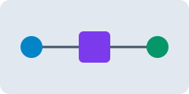

## 不均等な枝

H2 とリストの形式。深い一列の枝、多数の兄弟、長い日本語、リンク・画像・コードブロックを一つの文書に混在させる。

- 深い一列の枝
  - 二段目
    - 三段目
      - 四段目
        - 五段目
          - 六段目
            - 七段目（従来の見出し形式では作れない深さ）
              - 八段目
- 多数の兄弟
  - 兄弟 1
  - 兄弟 2
  - 兄弟 3
  - 兄弟 4
  - 兄弟 5
  - 兄弟 6
  - 兄弟 7
  - 兄弟 8
  - 兄弟 9
  - 兄弟 10
  - 兄弟 11
  - 兄弟 12
  - 兄弟 13
  - 兄弟 14
  - 兄弟 15
  - 兄弟 16
  - 兄弟 17
  - 兄弟 18
  - 兄弟 19
  - 兄弟 20
  - 兄弟 21
  - 兄弟 22
  - 兄弟 23
  - 兄弟 24
- 長い日本語のタイトルが一つの枝に集中し、折り返しの幅と隣の枝との間隔を確認するためのノードです。句読点、カタカナ、漢字、英数字 ABC 123 を混ぜています。
  - 短い
  - こちらも長いタイトルで、親と同じ幅の折り返しが発生する場合に線が文字の下へ伸びないことを確認します。
- リンクと画像
  [[heading-document|講座の構成]] と [[roundtrip-edge-cases#同じ名前]]、[外部資料](https://example.com)。
  ![[sample-image.svg]]
  - 画像の欠落
    ![[存在しない画像.png|120]]
  - Markdown 形式の画像
    
- `コード` を含むタイトル
  ```text
  # 本文のコードブロックは見出しにしない
  - 本文のコードブロックの箇条書きはノードにしない
  ```
  - コードの後の子
- 同じ名前
  - 一つ目の子
- 同じ名前
  - 二つ目の子
- 空に近い枝
